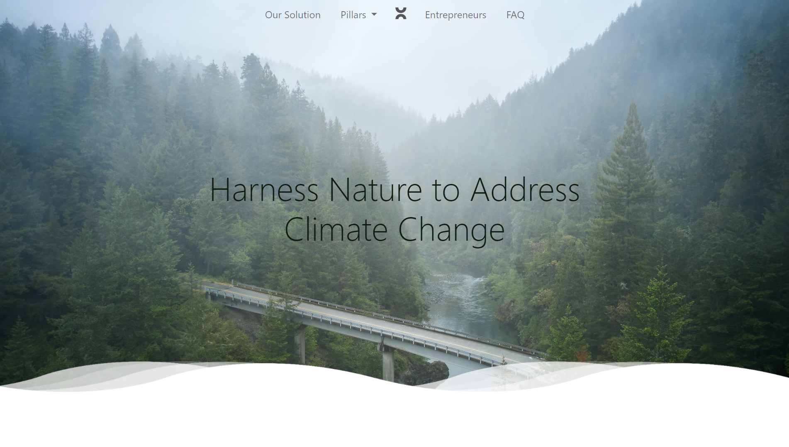
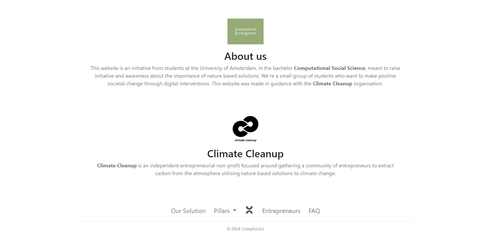
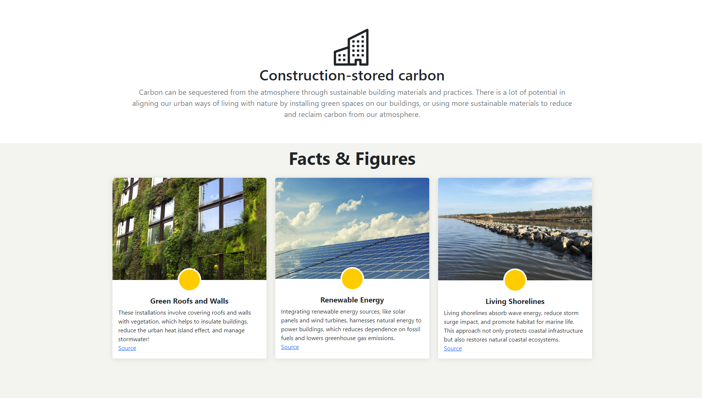

# Informative website about nature-based solutions

*The landing page of the website*

## Purpose
This is a website built as part of the semester 2 project for the University of Amsterdam's Computational Social Science bachelor's programme. 

The purpose of the website is to inform users about nature-based solutions to climate change and motivate behavioural change. The change being motivated is converting (potential) entrepreneurs into utilising nature-based solutions in their ventures.

It was made in collaboration with the non-profit foundation Climate Cleanup.

*About us section*

## Tech
The website is built almost entirely with Bootstrap 5, with additions on top utilising pure Javascript and CSS.

If you want to run the website yourself, just clone the repository and open index.html. There are no installs necessary.

*Section from the pillar page for construction-stored carbon*